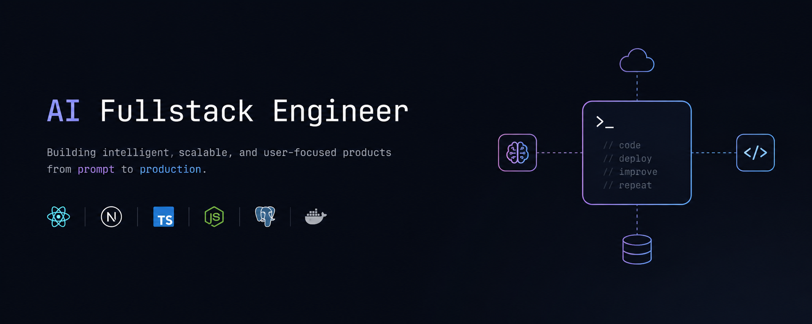

# 

<h1>Hello there!!  I'm Vigneshwaraa</h1>

Full-Stack AI Engineer with 6+ years of experience building scalable enterprise-grade SaaS platforms, AI-powered applications, and high-performance APIs. Specialized in **Generative AI**, **RAG pipelines**, **Agentic AI systems**, **FastAPI**, **Spring Boot**, **React.js optimization**, and **Azure DevOps workflow automation**. Proven expertise in handling millions of records with production-grade optimization strategies, reducing API latency, improving UI performance, and building scalable microservices architectures for enterprise environments.

🎨 As a UI designer in Figma, I bring a creative touch to my projects, ensuring both functionality and aesthetics align seamlessly.

---

 

 

---

## My Tech Stack 👨‍💻

**Languages**

&nbsp;
&nbsp;
&nbsp;
&nbsp;

**Frontend**

&nbsp;

**Backend & APIs**

&nbsp;
&nbsp;
&nbsp;
&nbsp;

**AI & ML**

&nbsp;
&nbsp;
&nbsp;

**Cloud & DevOps**

&nbsp;
&nbsp;
&nbsp;

**Databases**

&nbsp;
&nbsp;

---

## Certifications 🏅

- **Google Cloud Associate Cloud Engineer**

---

## My Workstation 💻

&nbsp;

---

## You can find me on 🌐

