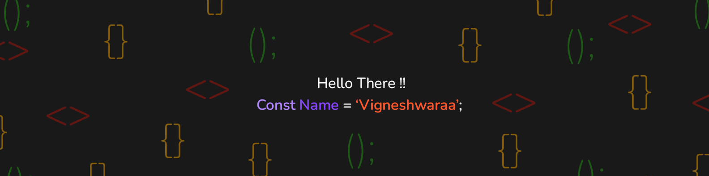

# 

<h1 align='center' >Hello there!!  I'm Vigneshwaraa</h1>

### I'm an aspiring frontend web developer with UI/UX design skills and a not so professional gamer.

 

## I'm currently 🌱

- Improving my React skills.
- Practing my front-end skills by building real life projects.

 

## My Tech Stack 👨‍💻

 &nbsp;
 &nbsp;
 &nbsp;
 
[![bootstra[]](https://img.shields.io/badge/Bootstrap-563D7C?style=for-the-badge&logo=bootstrap&logoColor=white)](https://getbootstrap.com/) &nbsp;
 &nbsp;

 

## My Workstation 💻

&nbsp;

 

## GitHub Stats 📊

&nbsp;

 

## Recent Work 👾

&nbsp;
&nbsp;
&nbsp;
&nbsp;
&nbsp;

 

## My coding friends 😜

&nbsp;

 

## You can find me on 🌐

&nbsp;
&nbsp;

